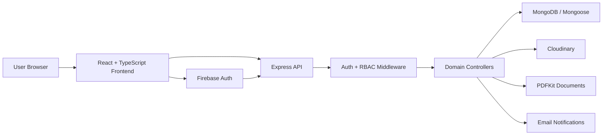

# Hospital Management System

An enterprise-style Hospital Management System built as a full-stack, role-aware clinical operations platform. The project combines secure authentication, patient and doctor workflows, appointments, EMR, laboratory, pharmacy, inpatient, billing, audit logs, dashboards, PDF generation, and Docker-ready deployment support.

This repository is designed for a final-year project, internship portfolio, hackathon prototype, or startup MVP foundation.

## Highlights

- **Modern frontend**: React, TypeScript, Tailwind CSS, Redux Toolkit, React Router, Axios, Recharts
- **Scalable backend**: Node.js, Express.js, MongoDB, Mongoose, modular routes/controllers/middleware
- **Authentication**: Firebase client auth, JWT access and refresh tokens, backend session bridge
- **Authorization**: role-based access control for Super Admin, Hospital Admin, Doctor, Receptionist, Pharmacist, Laboratory Technician, and Patient
- **Multi-tenant data model**: `hospitalId` support across domain resources
- **Security baseline**: bcrypt, Helmet, CORS, rate limiting, request validation, sanitized input, audit logging
- **Operational modules**: patients, doctors, appointments, EMR, prescriptions, lab reports, pharmacy, inpatient care, billing, payments
- **Production tooling**: Docker, Docker Compose, environment-based configuration, seed data, tests, Postman collection

## Demo Experience

The frontend includes a polished hospital console UI with:

- Role-specific dashboards
- Dark and light mode
- Multiple accent themes
- Responsive sidebar navigation
- Toast notifications
- Loading, empty, and workflow states
- Staff approval UI
- Audit log UI
- Patient timeline and profile tabs
- Appointment slot conflict warnings
- PDF-style prescription, bill, and lab report flows

Demo mode is available from the login screen for fast evaluation when the backend is not running.

## Tech Stack

| Layer | Technology |
| --- | --- |
| Frontend | React 19, TypeScript, Vite, Tailwind CSS |
| State | Redux Toolkit, React Redux |
| Routing | React Router |
| API Client | Axios |
| Charts | Recharts |
| Backend | Node.js, Express.js |
| Database | MongoDB, Mongoose |
| Auth | Firebase Auth, JWT, refresh tokens |
| Security | Helmet, CORS, rate limiting, mongo sanitize, HPP |
| Files | Cloudinary integration points, Multer validation |
| PDF | PDFKit |
| Testing | Vitest, Supertest, MongoDB Memory Server |
| Deployment | Docker, Docker Compose |

## System Architecture



## Core Modules

- **Authentication**: login, registration, forgot/reset password, Google sign-in, JWT session sync, protected routes
- **Patient Management**: patient CRUD, search, profile, emergency contacts, insurance, medical history
- **Doctor Management**: profiles, specialization, availability, fees, performance dashboard
- **Appointments**: booking, rescheduling, cancellation, status workflow, calendar-ready data
- **EMR**: diagnosis records, treatment history, notes, documents, prescriptions, reports
- **Prescriptions**: medicine details, dosage, history, PDF download
- **Laboratory**: test requests, sample status, results, report approval, PDF-style export
- **Pharmacy**: inventory, stock alerts, expiry tracking, purchase orders, sales records
- **Inpatient**: wards, rooms, beds, admissions, discharge flow
- **Billing**: consultation, room, lab, pharmacy charges, GST, invoices, payments
- **Admin**: revenue analytics, occupancy analytics, staff approvals, audit logs, reports

## Role Matrix

| Role | Primary Capabilities |
| --- | --- |
| Super Admin | Platform oversight, hospitals, global users |
| Hospital Admin | Staff approvals, dashboards, billing, audit logs, reports |
| Doctor | Appointments, patient history, prescriptions, lab reports |
| Receptionist | Patient registration, appointment booking, check-in workflows |
| Pharmacist | Inventory, dispensing, stock alerts, purchase orders |
| Laboratory Technician | Test requests, sample collection, results, report approval |
| Patient | Appointments, prescriptions, lab reports, bills, profile |

See the detailed [feature matrix](./docs/FEATURE_MATRIX.md).

## Project Structure

```text
.
├── backend
│   ├── src
│   │   ├── config
│   │   ├── controllers
│   │   ├── middleware
│   │   ├── models
│   │   ├── routes
│   │   ├── services
│   │   ├── tests
│   │   ├── utils
│   │   └── validators
│   └── Dockerfile
├── frontend
│   ├── src
│   │   ├── app
│   │   ├── components
│   │   ├── features
│   │   ├── services
│   │   └── types
│   └── Dockerfile
├── docs
├── docker-compose.yml
├── package.json
└── README.md
```

## Getting Started

### Prerequisites

- Node.js 20+
- npm 10+
- Docker Desktop, recommended for MongoDB
- Firebase project, optional for real Firebase login
- Cloudinary account, optional for production file uploads

### 1. Clone and Install

```bash
git clone https://github.com/rituraj1562/hospital-management-system.git
cd hospital-management-system
npm install
```

### 2. Configure Environment

```bash
cp .env.example .env
```

Update `.env` with your local or production values:

```env
PORT=5000
MONGO_URI=mongodb://mongo:27017/hms
JWT_ACCESS_SECRET=replace-with-a-long-random-access-secret
JWT_REFRESH_SECRET=replace-with-a-long-random-refresh-secret
CLIENT_URL=http://localhost:5173
VITE_API_URL=http://localhost:5000/api/v1
VITE_FIREBASE_API_KEY=
VITE_FIREBASE_AUTH_DOMAIN=
VITE_FIREBASE_PROJECT_ID=
VITE_FIREBASE_STORAGE_BUCKET=
VITE_FIREBASE_MESSAGING_SENDER_ID=
VITE_FIREBASE_APP_ID=
VITE_FIREBASE_MEASUREMENT_ID=
```

### 3. Run with Docker MongoDB

```bash
npm run dev:full
```

This starts:

- MongoDB through Docker Compose
- Express API at `http://localhost:5000`
- React frontend at `http://localhost:5173`

### 4. Seed Demo Data

In a second terminal:

```bash
npm run seed
```

Demo backend credentials:

```text
admin@demo-hms.local / Admin@12345
```

The login screen also includes frontend demo mode for quick UI review.

## Available Scripts

| Command | Description |
| --- | --- |
| `npm run dev` | Start backend and frontend dev servers |
| `npm run dev:full` | Start MongoDB, backend, and frontend |
| `npm run docker:db` | Start MongoDB only |
| `npm run docker:up` | Build and run the Docker Compose stack |
| `npm run seed` | Seed realistic HMS demo data |
| `npm run build` | Build/check backend and frontend |
| `npm run test` | Run backend and frontend tests |
| `npm run lint` | Run lint checks |

## API Overview

Base URL:

```text
http://localhost:5000/api/v1
```

Important API groups:

- `/auth`
- `/patients`
- `/doctors`
- `/appointments`
- `/medical-records`
- `/prescriptions`
- `/lab-reports`
- `/inventory`
- `/admissions`
- `/bills`
- `/payments`
- `/dashboard`
- `/audit-logs`

See [API documentation](./docs/API.md) and the [Postman collection](./docs/POSTMAN_COLLECTION.json).

## Security Design

- Password hashing with bcrypt
- Firebase UID mapped to MongoDB users
- JWT access and refresh token architecture
- Backend-enforced RBAC
- Hospital tenant isolation with `hospitalId`
- Request validation using express-validator
- Helmet security headers
- Strict CORS configuration support
- Rate limiting for API protection
- Audit trail for important mutations
- Soft-delete-ready model design

## Database Design

The backend includes Mongoose schemas for:

- Users
- Hospitals
- Patients
- Doctors
- Appointments
- Medical Records
- Prescriptions
- Bills
- Rooms
- Beds
- Medicines
- Inventory
- Lab Reports
- Payments
- Admissions
- Audit Logs

Additional architecture notes are available in [Architecture](./docs/ARCHITECTURE.md).

## Testing

Run all tests:

```bash
npm run test
```

Included test coverage:

- Auth controller behavior
- RBAC middleware behavior
- Appointment workflow behavior
- Frontend protected route behavior

## Docker Deployment

Build and run the full stack:

```bash
docker compose up --build
```

For production, configure:

- Strong JWT secrets
- MongoDB Atlas or managed MongoDB
- Firebase production project
- Cloudinary credentials
- SMTP provider
- HTTPS reverse proxy
- Production CORS origin
- Database backups and monitoring

## Documentation

- [Architecture](./docs/ARCHITECTURE.md)
- [API Documentation](./docs/API.md)
- [Implementation Plan](./docs/IMPLEMENTATION.md)
- [Feature Matrix](./docs/FEATURE_MATRIX.md)
- [Postman Collection](./docs/POSTMAN_COLLECTION.json)

## Roadmap

- Real-time notifications with WebSockets
- Advanced calendar drag-and-drop scheduling
- Role-specific analytics exports
- Insurance claim workflows
- Barcode support for pharmacy dispensing
- Document OCR for uploaded medical reports
- Multi-hospital subscription billing

## License

This project is provided for educational, portfolio, and MVP prototyping use. Review and add a formal license before commercial distribution.
