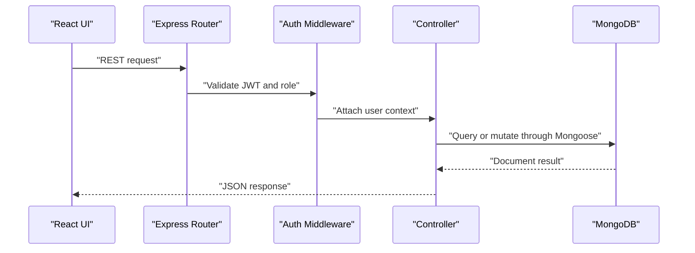
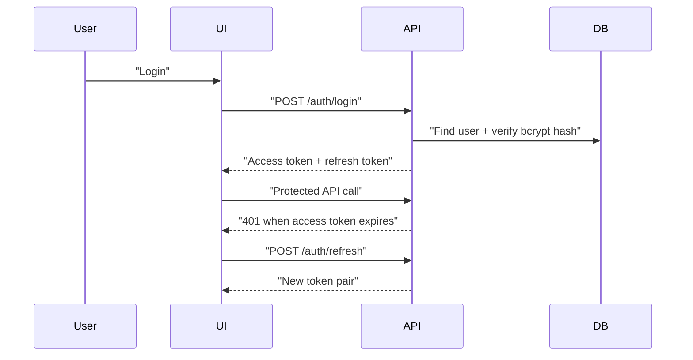
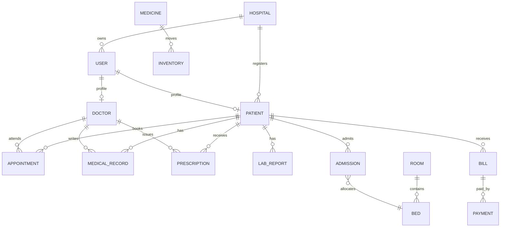

# Hospital Management System

## System Architecture

```mermaid
flowchart LR
  "React + TypeScript SPA" -->|"JWT access token"| "Express API"
  "Express API" -->|"Mongoose ODM"| "MongoDB"
  "Firebase Auth" -->|"ID token"| "React + TypeScript SPA"
  "Express API" -->|"Verify Firebase certs"| "Firebase Auth"
  "Express API" -->|"PDFKit streams"| "PDF Downloads"
  "Express API" -->|"Cloudinary SDK"| "Cloudinary File Storage"
  "Express API" -->|"SMTP"| "Email Notifications"
  "Redux Toolkit" --> "React + TypeScript SPA"
  "Protected Routes" --> "Redux Toolkit"
```

## API Flow



## Authentication Flow



## Database ER Diagram



## Folder Structure

```text
hms-enterprise-monorepo/
  backend/
    src/
      config/          environment, MongoDB, Cloudinary
      controllers/     auth, dashboards, PDFs, CRUD controllers
      middleware/      auth, RBAC, validation, security, errors
      models/          Mongoose schemas for HMS domains
      routes/          REST route composition
      services/        mail and PDF services
      utils/           tokens, roles, seed scripts
      validators/      express-validator rules
  frontend/
    src/
      app/             router, store, typed hooks
      components/      layout and reusable UI
      features/        auth, dashboards, modules
      services/        Axios client with refresh-token interceptor
      types/           shared TypeScript types
  docs/
    ARCHITECTURE.md
    API.md
    IMPLEMENTATION.md
```

## Scalability Recommendations

- Split high-volume domains into services when needed: appointments, billing, pharmacy, and lab reporting are natural boundaries.
- Add Redis for rate-limit storage, refresh-token deny lists, appointment slot locks, and dashboard caching.
- Use MongoDB replica sets, read preferences for analytics, and compound indexes on hospitalId, patientId, doctorId, status, and scheduledAt.
- Move notification sending and PDF generation to a queue worker with BullMQ or RabbitMQ.
- Store immutable audit trails for billing, prescriptions, and EMR changes.
- Add tenant isolation policy checks for hospitalId on every query before production.
- Add code splitting for chart-heavy dashboard routes to reduce frontend bundle size.
- Move audit logs and notifications to a queue when write volume increases.

## Production Deployment Strategy

- Build frontend to static assets and serve through Nginx or a CDN.
- Deploy the API as stateless containers behind a load balancer.
- Use managed MongoDB Atlas with backups, encryption at rest, and private networking.
- Store secrets in a vault or cloud secret manager, never in images.
- Enable HTTPS, strict CORS origins, Helmet, centralized logs, metrics, and uptime checks.
- Run CI with lint, typecheck, tests, vulnerability scanning, Docker build, and migration/seed smoke tests.
